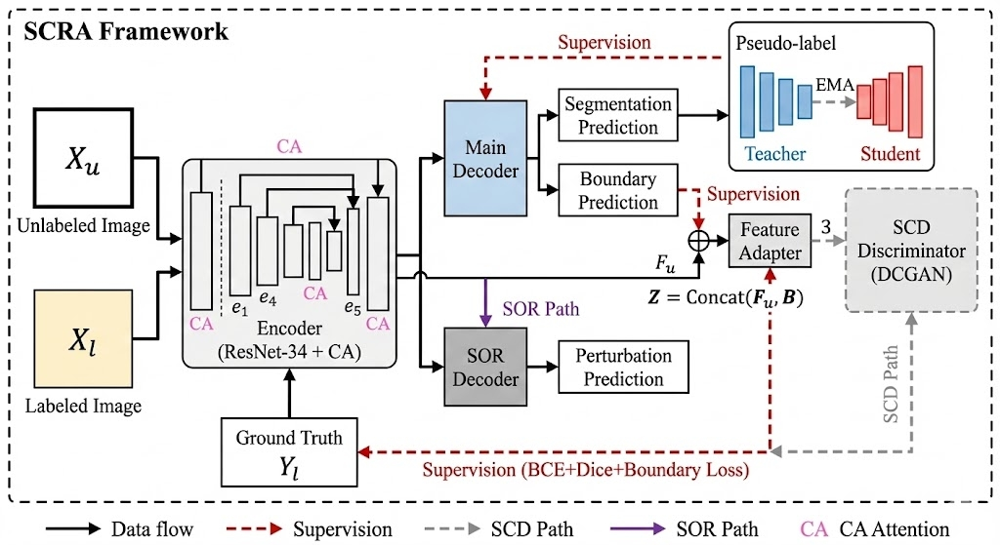

# SCRA: Addressing Boundary Ambiguity in Semi-Supervised Ultrasound Segmentation via Structure-Consistent Representation Alignment

This is the official implementation of the paper **"Addressing Boundary Ambiguity in Semi-Supervised Ultrasound Segmentation via Structure-Consistent Representation Alignment"**.

## Table of Contents

- [Introduction](#introduction)
- [Features](#features)
- [Requirements](#requirements)
- [Data Preparation](#data-preparation)
- [Quick Start](#quick-start)
- [Usage](#usage)
- [Project Structure](#project-structure)
- [Experimental Results](#experimental-results)
- [Citation](#citation)
- [License](#license)

## Introduction

This project proposes SCRA (Structure-Consistent Representation Alignment), a framework for addressing boundary ambiguity in semi-supervised ultrasound image segmentation. SCRA achieves structure-consistent representation alignment through three synergistic components:

1. **SCD (Structure-Contrast Discriminator)**: Enforces semantic-boundary alignment through adversarial learning
2. **SOR (Structure-Oriented Regularization)**: Promotes shape invariance under decoder perturbations
3. **CA (Coordinate Attention)**: Enhances structural localization by modeling directional dependencies

### Framework Overview

The overall architecture of SCRA is illustrated below:



The framework consists of:
- **Teacher-Student Architecture**: The teacher network (blue) guides the student (red) via EMA updates
- **SCD Path** (gray dashed): Enforces shape consistency through feature-boundary discrimination
- **SOR Path** (purple): Enhances structural robustness under perturbations
- **CA Path** (pink): Improves spatial localization via coordinate-aware attention

### Key Contributions

- Proposes Structure-Contrast Discriminator (SCD) that learns structure-consistent representations through feature-boundary joint representations
- Designs Structure-Oriented Regularization (SOR) that maintains structural stability under decoder perturbations
- Integrates Coordinate Attention (CA) mechanism to enhance spatial localization and boundary precision
- Achieves state-of-the-art performance on four public ultrasound datasets

## Features

- Supports multiple ultrasound datasets (BUSI, TN3K, PSFHS, HC18)
- Flexible semi-supervised training configuration (supports different annotation ratios)
- Modular design allowing individual enable/disable of components (SCD, SOR, CA)
- Detailed code comments for easy understanding and reproduction
- Complete evaluation metrics (Dice, IoU, HD95, ASD)

## Requirements

### Hardware Requirements

- GPU: NVIDIA GPU with CUDA support (recommended RTX 3090/4090 or higher)
- VRAM: At least 12GB (with batch_size=16)
- RAM: At least 16GB

### Software Requirements

- Python 3.7+
- PyTorch 1.8+ (recommended 1.10+)
- CUDA 10.2+ (recommended 11.0+)

### Installation

```bash
# Clone the repository
git clone https://github.com/YanHu826/addressing_boundary_ambiguity.git
cd addressing_boundary_ambiguity

# Install dependencies using requirements.txt (recommended)
pip install -r requirements.txt

# Or install manually
pip install torch torchvision
pip install opencv-python
pip install scikit-image
pip install scipy
pip install tqdm
pip install numpy
```

**Note**: If using CUDA, install PyTorch according to your CUDA version:
```bash
# CUDA 11.0
pip install torch torchvision --extra-index-url https://download.pytorch.org/whl/cu110

# CUDA 11.3
pip install torch torchvision --extra-index-url https://download.pytorch.org/whl/cu113
```

## Data Preparation

### Dataset Structure

The project supports the following datasets:
- **BUSI**: Breast ultrasound image segmentation dataset
- **TN3K**: Large-scale thyroid nodule segmentation dataset
- **PSFHS**: Prostate ultrasound segmentation dataset
- **HC18**: Fetal head circumference estimation challenge dataset

### Data Directory Structure

Organize your data according to the following structure:

```
your_data_root/
├── DATA/
│   ├── BUSI/
│   │   └── Dataset_BUSI_with_GT/
│   │       ├── images/
│   │       └── masks/
│   ├── TN3K/
│   │   └── images/
│   ├── PSFH/
│   │   └── images/
│   └── HC18/
│       └── images/
```

### Data Splits

Data split files are located in `airs/data/splits/` directory. Each dataset contains:
- `labeled.txt`: List of labeled data
- `unlabeled.txt`: List of unlabeled data
- `val.txt` / `test.txt`: Validation/test data lists

Annotation ratios are controlled by the `expID` parameter:
- `expID=1`: 1/8 annotation ratio (e.g., 72/647 for BUSI)
- `expID=2`: 1/4 annotation ratio (e.g., 144/647 for BUSI)
- `expID=3`: 1/2 annotation ratio (e.g., 288/647 for BUSI)

### Pretrained Weights

1. **ResNet-34 Backbone Weights**
   - Download: ImageNet pretrained ResNet-34 weights
   - Location: `airs/semi/code/pretrain/backbone/resnet34.pth`

2. **SCD Discriminator Pretrained Weights**
   - Download: From GAN pretraining module
   - Location: `airs/semi/code/models/pretrain/GAN/netD_epoch_10000.pth`

## Quick Start

### 1. Training

#### Semi-Supervised Training (Recommended)

```bash
cd airs/semi/code

# BUSI dataset, 1/8 annotation ratio (expID=1)
python main.py \
    --manner semi \
    --dataset BUSI \
    --expID 1 \
    --ratio 8 \
    --batch_size 16 \
    --nEpoch 200 \
    --lr 1e-4 \
    --GPUs 0 \
    --root /path/to/your/data/root \
    --ckpt_name busi_semi_1_8

# TN3K dataset, 1/4 annotation ratio (expID=2)
python main.py \
    --manner semi \
    --dataset TN3K \
    --expID 2 \
    --ratio 4 \
    --batch_size 16 \
    --nEpoch 200 \
    --lr 1e-4 \
    --GPUs 0 \
    --root /path/to/your/data/root \
    --ckpt_name tn3k_semi_1_4
```

#### Fully Supervised Training (Baseline)

```bash
python main.py \
    --manner full \
    --dataset BUSI \
    --batch_size 16 \
    --nEpoch 200 \
    --lr 1e-4 \
    --GPUs 0 \
    --root /path/to/your/data/root \
    --ckpt_name busi_full
```

### 2. Testing

```bash
python main.py \
    --manner test \
    --dataset BUSI \
    --expID 1 \
    --GPUs 0 \
    --root /path/to/your/data/root \
    --ckpt_name busi_semi_1_8
```

The test results will automatically compute and display the following metrics:
- Dice Similarity Coefficient (DSC)
- Intersection over Union (IoU)
- 95th percentile Hausdorff Distance (95HD)
- Average Surface Distance (ASD)

## Usage

### Main Parameters

#### Data-Related Parameters

| Parameter | Description | Default | Options |
|-----------|-------------|---------|---------|
| `--root` | Data root directory path | `/home/yh657/master_degree/` | Custom path |
| `--dataset` | Dataset name | `TN3K` | `BUSI`, `TN3K`, `PSFH`, `HC18`, `UDIAT` |
| `--expID` | Experiment ID (controls annotation ratio) | `0` | `1`(1/8), `2`(1/4), `3`(1/2) |
| `--ratio` | Annotation ratio denominator | `10` | `8`, `4`, `2` |

#### Training-Related Parameters

| Parameter | Description | Default |
|-----------|-------------|---------|
| `--manner` | Training mode | `full` | `full`, `semi`, `test` |
| `--nEpoch` | Number of training epochs | `200` |
| `--batch_size` | Batch size | `16` |
| `--lr` | Learning rate | `1e-4` |
| `--GPUs` | GPU device ID | `0` |
| `--ckpt_name` | Checkpoint save name | `None` |

#### Module Control Parameters

| Parameter | Description | Default |
|-----------|-------------|---------|
| `--no_scd` | Disable SCD module | `False` |
| `--no_sor` | Disable SOR module | `False` |
| `--no_ca` | Disable CA module | `False` |

### Training Examples

#### Full SCRA Framework Training

```bash
# Using all modules (SCD + SOR + CA)
python main.py \
    --manner semi \
    --dataset BUSI \
    --expID 1 \
    --ratio 8 \
    --batch_size 16 \
    --nEpoch 200 \
    --lr 1e-4 \
    --GPUs 0 \
    --root /path/to/data \
    --ckpt_name busi_scra_full
```

#### Ablation Studies

```bash
# Only SCD (disable SOR and CA)
python main.py \
    --manner semi \
    --dataset BUSI \
    --expID 1 \
    --ratio 8 \
    --no_sor \
    --no_ca \
    --ckpt_name busi_scd_only

# Only SOR (disable SCD and CA)
python main.py \
    --manner semi \
    --dataset BUSI \
    --expID 1 \
    --ratio 8 \
    --no_scd \
    --no_ca \
    --ckpt_name busi_sor_only

# Only CA (disable SCD and SOR)
python main.py \
    --manner semi \
    --dataset BUSI \
    --expID 1 \
    --ratio 8 \
    --no_scd \
    --no_sor \
    --ckpt_name busi_ca_only
```

### Checkpoint Management

During training, model checkpoints are automatically saved to:
```
airs/semi/checkpoint/{ckpt_name}/
├── best.pth          # Best F1 score model
├── second_best.pth   # Second best F1 score model
└── third_best.pth    # Third best F1 score model
```

The `best.pth` will be automatically loaded during testing.

## Project Structure

```
Shape-Prior-Semi-Seg/
├── airs/
│   ├── data/
│   │   └── splits/          # Data split files
│   │       ├── BUSI/
│   │       ├── TN3K/
│   │       ├── PSFH/
│   │       └── HC18/
│   ├── GAN/                 # GAN pretraining module
│   │   ├── data/
│   │   ├── models/
│   │   └── main.py
│   └── semi/                # Semi-supervised training main code
│       ├── code/
│       │   ├── data/        # Dataset loading
│       │   ├── models/      # Model definitions
│       │   │   ├── semi_self.py      # SCRA main network
│       │   │   ├── modern_attention.py  # CA module
│       │   │   └── dc_gan.py         # SCD discriminator
│       │   ├── utils/       # Utility functions
│       │   │   ├── loss.py           # Loss functions (including Sobel boundary extraction)
│       │   │   └── evaluate.py       # Evaluation metrics
│       │   ├── main.py      # Training/testing main program
│       │   └── opt.py       # Parameter configuration
│       └── checkpoint/      # Model checkpoints
├── assets/                  # Resource files
│   └── framework.png       # Framework diagram
└── README.md
```

### Core Files

- **`semi_self.py`**: SCRA main network implementation, including encoder, CA module, dual decoders, and SOR module
- **`modern_attention.py`**: Coordinate Attention (CA) module implementation
- **`dc_gan.py`**: SCD discriminator implementation
- **`loss.py`**: Loss function implementation, including Sobel boundary extraction function
- **`main.py`**: Training and testing main program, including SCD and SOR training logic

## Experimental Results

### Performance Comparison

Results on BUSI dataset (1/8 annotation ratio):

| Method | Dice (%) | IoU (%) |
|--------|----------|---------|
| U-Net (Fully Supervised) | 77.06 | 70.88 |
| FixMatch | 42.76 | 34.96 |
| Shape Prior | 75.19 | 66.90 |
| **SCRA (Ours)** | **77.58** | **69.11** |

Results on TN3K dataset (1/8 annotation ratio):

| Method | Dice (%) | IoU (%) |
|--------|----------|---------|
| U-Net (Fully Supervised) | 73.98 | 62.95 |
| FixMatch | 61.59 | 49.36 |
| Shape Prior | 82.21 | 73.16 |
| **SCRA (Ours)** | **82.41** | **72.83** |

For detailed experimental results, please refer to the paper.

### Ablation Studies

Contribution of each module (BUSI dataset, 1/8 annotation ratio):

| SCD | SOR | CA | Dice (%) | IoU (%) |
|-----|-----|-----|----------|---------|
| No | No | No | 69.94 | 59.58 |
| Yes | No | No | 75.71 | 67.47 |
| Yes | Yes | No | 73.40 | 62.42 |
| Yes | Yes | Yes | **77.58** | **69.11** |

## Technical Details

### SCRA Framework Components

1. **SCD (Structure-Contrast Discriminator)**
   - Input: Z = Concat(F_u, B), where F_u is encoder feature and B is Sobel boundary map
   - Loss: Adversarial loss + Feature matching loss
   - Weights: λ_adv = 0.1, λ_FM = 1.0

2. **SOR (Structure-Oriented Regularization)**
   - Method: Apply dropout perturbation to decoder output
   - Loss: L_SOR = λ_SOR * ||G(p) - G(p_hat)||_1
   - Weight: λ_SOR = 0.2

3. **CA (Coordinate Attention)**
   - Location: Embedded in encoder skip connections
   - Function: Enhances spatial localization and boundary precision

### Training Strategy

- Optimizer: Adam (lr=1e-4, weight_decay=1e-5)
- Learning Rate: Polynomial decay (power=0.9)
- Batch Size: 16 (4 labeled + 4 unlabeled)
- Data Augmentation: Random flip, rotation, scaling, Gaussian noise

## FAQ

### Q1: How to modify data path?

A: Modify the `--root` parameter to point to your data root directory. Make sure the data directory structure meets the requirements.

### Q2: What to do when encountering out-of-memory errors during training?

A: Try the following methods:
- Reduce `--batch_size` (e.g., from 16 to 8)
- Reduce input image size (modify data loading code)
- Use gradient accumulation

### Q3: How to train only a specific module?

A: Use module control parameters:
```bash
# Only SCD
--no_sor --no_ca

# Only SOR
--no_scd --no_ca

# Only CA
--no_scd --no_sor
```

### Q4: Where to download pretrained weights?

A:
- ResNet-34 weights: Download from PyTorch official or ImageNet pretrained models
- SCD discriminator weights: Need to run GAN pretraining module first

### Q5: How to reproduce the experimental results in the paper?

A: Use the same configuration as reported in the paper:
- Data splits: Use the provided split files
- Hyperparameters: Use default parameters (already set in code)
- Random seed: Recommend setting a fixed random seed for reproducibility

### Q6: Which datasets are supported?

A: Currently supports:
- BUSI (Breast ultrasound)
- TN3K (Thyroid nodule)
- PSFHS (Prostate ultrasound)
- HC18 (Fetal head circumference)
- UDIAT (Breast ultrasound)

### Q7: How to add a new dataset?

A:
1. Create a new dataset class in `airs/semi/code/data/`
2. Add dataset loading logic in `build_dataset.py`
3. Add new option to `--dataset` parameter in `opt.py`
4. Prepare data split files in `airs/data/splits/`

## License

This project is licensed under the [LICENSE](LICENSE) file.

## Acknowledgments

We would like to express our sincere gratitude to:

- **Dataset Providers**: We thank the creators and maintainers of the BUSI, TN3K, PSFHS, and HC18 datasets for making their data publicly available, which enabled this research.

- **Open Source Community**: 
  - PyTorch team for providing an excellent deep learning framework
  - The open-source community for various tools and libraries that made this work possible

- **Related Work**: We acknowledge the contributions of previous works in semi-supervised learning and medical image segmentation, particularly:
  - Shape Prior framework for shape-aware semi-supervised segmentation
  - Coordinate Attention mechanism
  - Various semi-supervised learning methods that inspired our approach

- **Institutional Support**: We thank the University of Exeter for providing computational resources and support for this research.

- **Reviewers and Contributors**: We appreciate the valuable feedback from reviewers and the research community that helped improve this work.

## Contact

For questions or suggestions, please contact:

- Email: yh657@exeter.ac.uk
- GitHub Issues: [Submit an issue](https://github.com/YanHu826/addressing_boundary_ambiguity/issues)

## Changelog

### v1.0.0 (2025-01-XX)
- Initial release
- Complete SCRA framework implementation
- Support for BUSI, TN3K, PSFHS, HC18 datasets
- Detailed code comments added

---

**Note**: Please ensure that data is organized correctly according to the data preparation section and download necessary pretrained weights. If you encounter any issues, please check GitHub Issues or contact the authors.
