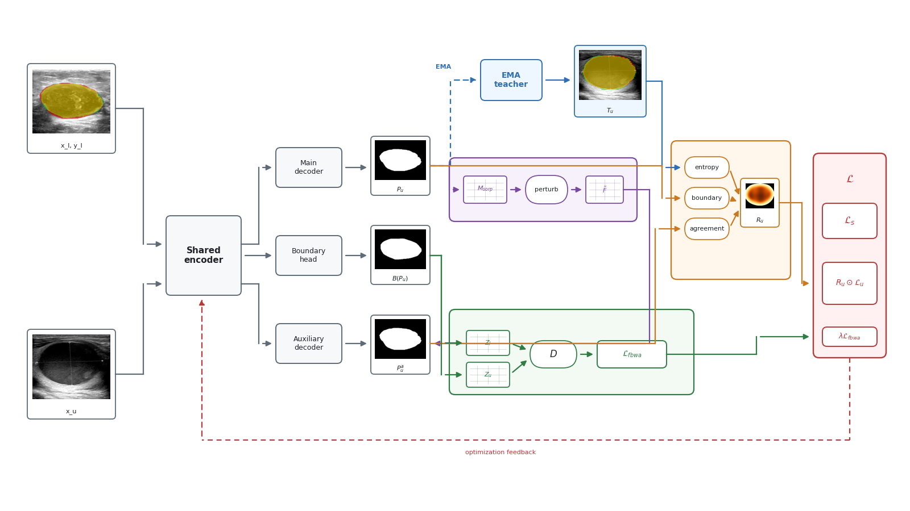
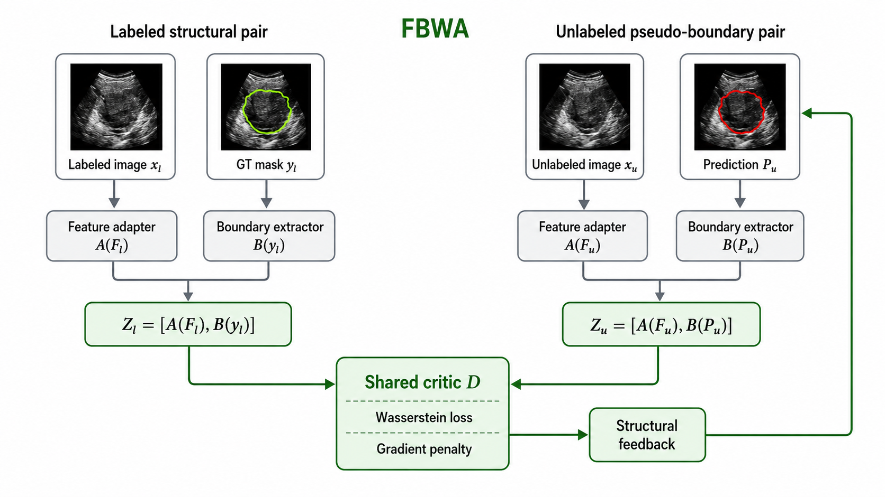
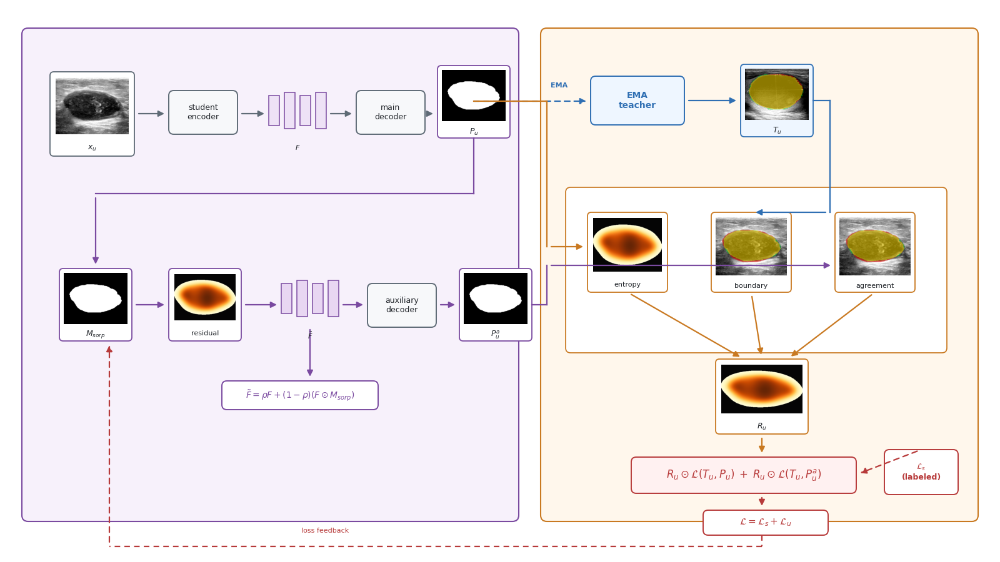

# BRACE: Boundary-Reliability Knowledge Alignment for Semi-Supervised Ultrasound Segmentation

This is the official implementation of the paper **"BRACE: A Boundary-Reliability Knowledge Alignment Framework for Semi-Supervised Ultrasound Segmentation"**.

## Table of Contents

- [Introduction](#introduction)
- [Features](#features)
- [Requirements](#requirements)
- [Data Preparation](#data-preparation)
- [Quick Start](#quick-start)
- [Usage](#usage)
- [Project Structure](#project-structure)
- [Experimental Results](#experimental-results)
- [Citation](#citation)
- [License](#license)

## Introduction

This project proposes BRACE (Boundary-Reliability Knowledge Alignment), a framework for addressing boundary ambiguity in semi-supervised ultrasound image segmentation. BRACE treats pseudo-label learning as knowledge transfer and aligns structural boundary information with reliability-aware pseudo-supervision through three coupled components:

1. **FBWA (Feature-Boundary Wasserstein Alignment)**: aligns feature-boundary representations with a gradient-penalized Wasserstein critic.
2. **SORP (Structure-Oriented Residual Perturbation)**: constructs an auxiliary structure-sensitive view for perturbation-aware learning.
3. **RCT (Reliability-Calibrated Co-teaching)**: weights pseudo-label supervision by entropy-derived reliability and couples boundary calibration with main-auxiliary decoder agreement.

### Framework Overview

The overall architecture of BRACE is illustrated below:



The framework consists of:
- **Teacher-student architecture**: The EMA teacher supplies pseudo-label knowledge to the shared student network.
- **FBWA path**: Aligns labeled and unlabeled feature-boundary pairs through a Wasserstein-style critic.
- **SORP auxiliary view**: Constructs a perturbation-aware auxiliary prediction from prediction-guided residual features.
- **RCT training path**: Calibrates pseudo-label transfer using entropy reliability, boundary calibration, and main-auxiliary decoder agreement.

The main knowledge-alignment modules are summarized below:





### Key Contributions

- Proposes Feature-Boundary Wasserstein Alignment (FBWA) that learns structure-consistent representations through feature-boundary joint representations
- Designs Structure-Oriented Residual Perturbation (SORP) that maintains structural stability under decoder perturbations
- Integrates Reliability-Calibrated Co-teaching (RCT) to reduce unreliable pseudo-label transfer under scarce annotations
- Evaluates BRACE on four public ultrasound segmentation datasets under protocol-aligned settings

## Features

- Supports multiple ultrasound datasets (BUSI, TN3K, PSFHS, HC18)
- Flexible semi-supervised training configuration (supports different annotation ratios)
- Modular design allowing component ablations for FBWA, SORP, encoder attention, and reliability/cross-teaching terms
- Detailed code comments for easy understanding and reproduction
- Complete evaluation metrics (Dice, IoU, HD95, ASD)

## Requirements

### Hardware Requirements

- GPU: NVIDIA GPU with CUDA support (recommended RTX 3090/4090 or higher)
- VRAM: At least 12GB (with batch_size=16)
- RAM: At least 16GB

### Software Requirements

- Python 3.7+
- PyTorch 1.8+ (recommended 1.10+)
- CUDA 10.2+ (recommended 11.0+)

### Installation

```bash
# Clone the repository
git clone https://github.com/YanHu826/addressing_boundary_ambiguity.git
cd addressing_boundary_ambiguity

# Install dependencies using requirements.txt (recommended)
pip install -r requirements.txt

# Or install manually
pip install torch torchvision
pip install opencv-python
pip install scikit-image
pip install scipy
pip install tqdm
pip install numpy
```

**Note**: If using CUDA, install PyTorch according to your CUDA version:
```bash
# CUDA 11.0
pip install torch torchvision --extra-index-url https://download.pytorch.org/whl/cu110

# CUDA 11.3
pip install torch torchvision --extra-index-url https://download.pytorch.org/whl/cu113
```

### Reproducibility Pipeline

For a full paper-style run on a local workstation or a generic GPU server, use:

```bash
SEMI_EXTRA_ARGS="--disable_tqdm --log_first_batches 1" \
bash scripts/run_training_pipeline.sh run
```

`bash scripts/run_training_pipeline.sh run` defaults to:

- `PIPELINE_CONFIGS=PAPER_ALL`, which expands to `TN3K`, `BUSI`, `HC18`, and `PSFH` with their supported `expID`s
- full BRACE first by default, followed by staged ablations such as `full`, `baseline`, `scd_only` (FBWA only), and `scd_sor` (FBWA + SORP). The `scd_*` names are legacy CLI aliases retained for checkpoint compatibility.
- per-experiment checkpoints, visual results, and logs under `outputs/`
- a merged Markdown test summary at `outputs/summary/test_results.md`

Useful overrides:

```bash
# Skip dependency installation when the environment is already ready
AUTO_INSTALL_DEPS=0 bash scripts/run_training_pipeline.sh run

# Run a subset of datasets
PIPELINE_CONFIGS="TN3K:1 BUSI:1" bash scripts/run_training_pipeline.sh run

# Run ablation variants in addition to the full BRACE model
RUN_ABLATION=1 bash scripts/run_training_pipeline.sh run
```

## Data Preparation

### Dataset Structure

The project supports the following datasets:
- **BUSI**: Breast ultrasound image segmentation dataset
- **TN3K**: Large-scale thyroid nodule segmentation dataset
- **PSFHS**: Fetal ultrasound segmentation dataset with PS/FH targets
- **HC18**: Fetal head circumference estimation challenge dataset

### Data Directory Structure

Organize your data according to the following structure:

```
your_data_root/
├── DATA/
│   ├── BUSI/
│   │   └── Dataset_BUSI_with_GT/
│   │       ├── images/
│   │       └── masks/
│   ├── TN3K/
│   │   └── images/
│   ├── PSFH/
│   │   └── images/
│   └── HC18/
│       └── images/
```

### Data Splits

Data split files are located in `airs/data/splits/` directory. Each dataset contains:
- `labeled.txt`: List of labeled data
- `unlabeled.txt`: List of unlabeled data
- `val.txt` / `test.txt`: Validation/test data lists

Annotation ratios are controlled by the `expID` parameter:
- `expID=1`: 1/8 annotation ratio (e.g., 72/647 for BUSI)
- `expID=2`: 1/4 annotation ratio (e.g., 144/647 for BUSI)
- `expID=3`: 1/2 annotation ratio (e.g., 288/647 for BUSI)

### Pretrained Weights

1. **ResNet-34 Backbone Weights**
   - Download: ImageNet pretrained ResNet-34 weights
   - Location: `airs/semi/code/pretrain/backbone/resnet34.pth`

2. **FBWA Critic Pretrained Weights**
   - Download: From GAN pretraining module
   - Location: `airs/semi/code/models/pretrain/GAN/netD_epoch_10000.pth`

## Quick Start

### 1. Training

#### Semi-Supervised Training (Recommended)

```bash
cd airs/semi/code

# BUSI dataset, 1/8 annotation ratio (expID=1)
python main.py \
    --manner semi \
    --dataset BUSI \
    --expID 1 \
    --ratio 8 \
    --batch_size 16 \
    --nEpoch 200 \
    --lr 1e-4 \
    --GPUs 0 \
    --root /path/to/your/data/root \
    --ckpt_name busi_semi_1_8

# TN3K dataset, 1/4 annotation ratio (expID=2)
python main.py \
    --manner semi \
    --dataset TN3K \
    --expID 2 \
    --ratio 4 \
    --batch_size 16 \
    --nEpoch 200 \
    --lr 1e-4 \
    --GPUs 0 \
    --root /path/to/your/data/root \
    --ckpt_name tn3k_semi_1_4
```

#### Fully Supervised Training (Baseline)

```bash
python main.py \
    --manner full \
    --dataset BUSI \
    --batch_size 16 \
    --nEpoch 200 \
    --lr 1e-4 \
    --GPUs 0 \
    --root /path/to/your/data/root \
    --ckpt_name busi_full
```

### 2. Testing

```bash
python main.py \
    --manner test \
    --dataset BUSI \
    --expID 1 \
    --GPUs 0 \
    --root /path/to/your/data/root \
    --ckpt_name busi_semi_1_8
```

Final test now prefers the student `best_dice.pth` checkpoint, then falls back to `best.pth` for backward compatibility. To evaluate the EMA teacher explicitly, add `--test_ckpt_role teacher`.

For datasets that do not ship an independent `test.txt` split yet (the current BUSI setup), `--manner test` falls back to `val.txt` and prints a warning so the evaluation scope is explicit.

The test results will automatically compute and display the following metrics:
- Dice Similarity Coefficient (DSC)
- Intersection over Union (IoU)
- 95th percentile Hausdorff Distance (95HD)
- Average Surface Distance (ASD)

## Usage

### Main Parameters

#### Data-Related Parameters

| Parameter | Description | Default | Options |
|-----------|-------------|---------|---------|
| `--root` | Workspace root containing both the repo and a sibling `DATA` directory | Auto-detected project parent | Custom path |
| `--dataset` | Dataset name | `TN3K` | `BUSI`, `TN3K`, `PSFH`, `HC18`, `UDIAT` |
| `--expID` | Experiment ID (controls annotation ratio) | `0` | `1`(1/8), `2`(1/4), `3`(1/2) |
| `--ratio` | Annotation ratio denominator | `10` | `8`, `4`, `2` |

#### Training-Related Parameters

| Parameter | Description | Default |
|-----------|-------------|---------|
| `--manner` | Training mode | `full` | `full`, `semi`, `test` |
| `--nEpoch` | Number of training epochs | `200` |
| `--batch_size` | Batch size | `16` |
| `--lr` | Learning rate | `1e-4` |
| `--GPUs` | GPU device ID | `0` |
| `--ckpt_name` | Checkpoint save name | `None` |

#### Module Control Parameters

| Parameter | Description | Default |
|-----------|-------------|---------|
| `--no_scd` | Disable FBWA module; legacy flag name retained for compatibility | `False` |
| `--no_sor` | Disable SORP auxiliary decoder branch; legacy flag name retained for compatibility | `False` |
| `--no_ca` | Disable coordinate-attention encoder support | `False` |

### Training Examples

#### Full BRACE Framework Training

```bash
# Using the full BRACE configuration
python main.py \
    --manner semi \
    --dataset BUSI \
    --expID 1 \
    --ratio 8 \
    --batch_size 16 \
    --nEpoch 200 \
    --lr 1e-4 \
    --GPUs 0 \
    --root /path/to/data \
    --ckpt_name busi_brace_full
```

#### Ablation Studies

```bash
# Baseline (disable FBWA, SORP, and encoder attention)
python main.py \
    --manner semi \
    --dataset BUSI \
    --expID 1 \
    --ratio 8 \
    --no_scd \
    --no_sor \
    --no_ca \
    --ckpt_name busi_baseline

# FBWA only
python main.py \
    --manner semi \
    --dataset BUSI \
    --expID 1 \
    --ratio 8 \
    --no_sor \
    --no_ca \
    --ckpt_name busi_fbwa_only

# FBWA + SORP
python main.py \
    --manner semi \
    --dataset BUSI \
    --expID 1 \
    --ratio 8 \
    --no_ca \
    --ckpt_name busi_fbwa_sorp

# Full BRACE
python main.py \
    --manner semi \
    --dataset BUSI \
    --expID 1 \
    --ratio 8 \
    --ckpt_name busi_full
```

### Checkpoint Management

During training, model checkpoints are automatically saved to:
```
outputs/semi/checkpoints/{ckpt_name}/
├── best_dice.pth
├── best.pth
├── second_best.pth
└── third_best.pth
```

Related artifacts are separated by experiment name:

```text
outputs/semi/results/{ckpt_name}/{manner}/
outputs/logs/semi/{ckpt_name}_{manner}.log
outputs/summary/test_results.md
```

Testing automatically loads the student `best_dice.pth` when available, otherwise `best.pth`, and each finished `test` run appends one row to the shared Markdown summary.

## Project Structure

```
addressing_boundary_ambiguity/
├── airs/
│   ├── data/
│   │   └── splits/          # Data split files
│   │       ├── BUSI/
│   │       ├── TN3K/
│   │       ├── PSFH/
│   │       └── HC18/
│   ├── GAN/                 # GAN pretraining module
│   │   ├── data/
│   │   ├── models/
│   │   └── main.py
│   └── semi/                # Semi-supervised training main code
│       ├── code/
│       │   ├── data/        # Dataset loading
│       │   ├── models/      # Model definitions
│       │   │   ├── semi_self.py          # BRACE main network
│       │   │   ├── modern_attention.py   # Encoder attention support
│       │   │   └── dc_gan.py             # FBWA critic
│       │   ├── utils/       # Utility functions
│       │   │   ├── loss.py           # Loss functions (including Sobel boundary extraction)
│       │   │   └── evaluate.py       # Evaluation metrics
│       │   ├── main.py      # Training/testing main program
│       │   └── opt.py       # Parameter configuration
│       └── checkpoint/      # Model checkpoints
├── assets/                  # Resource files
│   └── framework.png       # BRACE framework diagram
└── README.md
```

### Core Files

- **`semi_self.py`**: BRACE main network implementation, including encoder, dual decoders, and SORP module
- **`modern_attention.py`**: Encoder attention support used by the segmentation backbone
- **`dc_gan.py`**: FBWA critic implementation
- **`loss.py`**: Loss function implementation, including reliability weighting and Sobel boundary extraction
- **`main.py`**: Training and testing main program, including FBWA, SORP, and RCT training logic

## Experimental Results

### Performance Comparison

Representative BRACE results reported in the KBS manuscript:

| Dataset / protocol | Metric | BRACE |
|---|---:|---:|
| BUSI 1/8 | Dice / IoU (%) | 78.52 / 70.44 |
| TN3K 1/8 | Dice / IoU (%) | 83.66 / 74.95 |
| PSFHS 20% | PS/FH Dice (%) | 82.32 / 92.61 |
| HC18 10% / 20% | DSC (%) | 96.88 / 97.01 |

For detailed experimental results, please refer to the paper.

### Ablation Studies

Representative component analysis on BUSI under the 1/8 labeled setting:

| Variant | Dice (%) | IoU (%) |
|---|---:|---:|
| Baseline | 75.37 | 66.58 |
| BRACE | **77.69** | **69.12** |
| w/o FBWA | 75.19 | 65.53 |
| w/o SORP | 76.35 | 66.61 |
| w/o RCT | 76.57 | 67.41 |
| w/o encoder attention | 75.39 | 65.49 |

## Technical Details

### BRACE Framework Components

1. **FBWA (Feature-Boundary Wasserstein Alignment)**
   - Input: Z = Concat(F_u, B), where F_u is encoder feature and B is Sobel boundary map
   - Objective: Gradient-penalized Wasserstein alignment between labeled and unlabeled feature-boundary representations
   - Default weight: λ_adv = 0.1

2. **SORP (Structure-Oriented Residual Perturbation)**
   - Method: Construct an auxiliary structure-sensitive perturbation view
   - Role: Expose residual structural variation and couple the auxiliary view through pseudo-label co-teaching
   - Default coupling weight: λ_SORP = 0.05

3. **RCT (Reliability-Calibrated Co-teaching)**
   - Reliability: Entropy-derived reliability map for pseudo-label supervision
   - Calibration: Boundary supervision and main-auxiliary decoder agreement
   - Default cross-teaching weight: λ_cross = 0.3

### Training Strategy

- Optimizer: Adam (lr=1e-4, weight_decay=1e-5)
- Learning Rate: Polynomial decay (power=0.9)
- Batch Size: 16 (4 labeled + 4 unlabeled)
- Data Augmentation: Random flip, rotation, scaling, Gaussian noise

## FAQ

### Q1: How to modify data path?

A: Modify the `--root` parameter to point to your data root directory. Make sure the data directory structure meets the requirements.

### Q2: What to do when encountering out-of-memory errors during training?

A: Try the following methods:
- Reduce `--batch_size` (e.g., from 16 to 8)
- Reduce input image size (modify data loading code)
- Use gradient accumulation

### Q3: How to train only a specific module?

A: The recommended paper-style staged ablation is:
```bash
# Baseline; legacy flag names are retained by the CLI
--no_scd --no_sor --no_ca

# FBWA only
--no_sor --no_ca

# FBWA + SORP
--no_ca

# Full BRACE
# (pass no disable flags)
```

If you still want leave-one-out variants, the pipeline also accepts aliases such as `wo_scd`, `wo_sor`, and `wo_ca`.

### Q4: Where to download pretrained weights?

A:
- ResNet-34 weights: Download from PyTorch official or ImageNet pretrained models
- FBWA critic weights: Need to run GAN pretraining module first

### Q5: How to reproduce the experimental results in the paper?

A: Use the same configuration as reported in the paper:
- Data splits: Use the provided split files
- Hyperparameters: Use default parameters (already set in code)
- Random seed: Recommend setting a fixed random seed for reproducibility

### Q6: Which datasets are supported?

A: Currently supports:
- BUSI (Breast ultrasound)
- TN3K (Thyroid nodule)
- PSFHS (Fetal ultrasound PS/FH segmentation)
- HC18 (Fetal head circumference)
- UDIAT (Breast ultrasound)

### Q7: How to add a new dataset?

A:
1. Create a new dataset class in `airs/semi/code/data/`
2. Add dataset loading logic in `build_dataset.py`
3. Add new option to `--dataset` parameter in `opt.py`
4. Prepare data split files in `airs/data/splits/`

## License

This project is licensed under the [LICENSE](LICENSE) file.

## Acknowledgments

We would like to express our sincere gratitude to:

- **Dataset Providers**: We thank the creators and maintainers of the BUSI, TN3K, PSFHS, and HC18 datasets for making their data publicly available, which enabled this research.

- **Open Source Community**: 
  - PyTorch team for providing an excellent deep learning framework
  - The open-source community for various tools and libraries that made this work possible

- **Related Work**: We acknowledge the contributions of previous works in semi-supervised learning and medical image segmentation, particularly:
  - Shape Prior framework for shape-aware semi-supervised segmentation
  - Coordinate Attention mechanism
  - Various semi-supervised learning methods that inspired our approach

- **Institutional Support**: We thank the University of Exeter for providing computational resources and support for this research.

- **Reviewers and Contributors**: We appreciate the valuable feedback from reviewers and the research community that helped improve this work.

## Contact

For questions or suggestions, please contact:

- Email: yh657@exeter.ac.uk
- GitHub Issues: [Submit an issue](https://github.com/YanHu826/addressing_boundary_ambiguity/issues)

## Changelog

### v1.0.0 (2025-01-XX)
- Initial release
- Complete BRACE framework implementation
- Support for BUSI, TN3K, PSFHS, HC18 datasets
- Detailed code comments added

---

**Note**: Please ensure that data is organized correctly according to the data preparation section and download necessary pretrained weights. If you encounter any issues, please check GitHub Issues or contact the authors.
